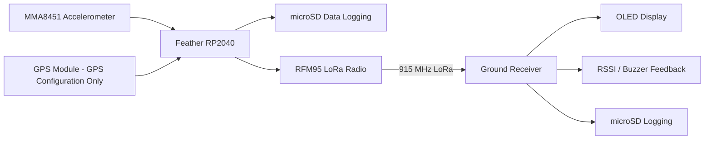

# LoRa Rocket Telemetry System

An embedded wireless telemetry system developed as part of undergraduate research at California State University Channel Islands.

The project uses Adafruit Feather RP2040 microcontrollers with RFM95 LoRa radios to transmit sensor data from model rockets to a ground receiver during field experiments. The system was designed to collect accelerometer data, transmit telemetry over 915 MHz LoRa, and record data locally using microSD storage.

During field testing, multiple rockets were used. Most used the standard accelerometer telemetry configuration, while one rocket was equipped with an additional GPS module and required a separate GPS-capable transmitter and receiver configuration.

## Project Goals

The main goals of the project were to:

- Transmit sensor telemetry wirelessly from a model rocket to a ground station.
- Record telemetry locally to microSD storage.
- Monitor received data and radio signal strength during field testing.
- Integrate multiple sensors and peripherals with an RP2040-based microcontroller.
- Develop a system that could operate in a field environment without internet access.
- Learn how embedded hardware, software, and RF communication behave outside of a laboratory environment.

## Hardware

The project used hardware including:

- Adafruit Feather RP2040 with RFM95 LoRa radio
- RFM95 LoRa radio operating at 915 MHz
- Adafruit MMA8451 three-axis accelerometer
- Adafruit microSD card breakout
- GPS module on one rocket configuration
- OLED display on the ground receiver
- Buzzer for receiver signal feedback

## System Architecture


## Field Configurations

### Standard Rocket Configuration

The standard configuration was used on most of the rockets during field testing.

It included:

- MMA8451 accelerometer
- LoRa telemetry transmission
- microSD data logging
- Ground receiver with telemetry display and RSSI monitoring

The corresponding firmware can be found in:

```text
firmware/
└── standard_rocket/
    ├── standard_transmitter/
    └── standard_receiver/
```

### GPS Rocket Configuration

One rocket was equipped with a GPS module shortly before field testing. This required a modified telemetry payload and corresponding changes to both the transmitter and receiver.

In addition to the standard accelerometer telemetry, this configuration included:

- GPS latitude and longitude
- GPS fix status
- Satellite information

The corresponding firmware can be found in:

```text
firmware/
└── gps_rocket/
    ├── gps_transmitter/
    └── gps_receiver/
```

The GPS configuration was created as a field-specific variant rather than as a replacement for the standard configuration.

## Repository Structure

```text
LoRa-Telemetry-System/
│
├── firmware/
│   ├── standard_rocket/
│   │   ├── standard_transmitter/
│   │   └── standard_receiver/
│   │
│   └── gps_rocket/
│       ├── gps_transmitter/
│       └── gps_receiver/
│
├── field_debug/
│   ├── transmitter_no_sd/
│   └── transmitter_no_radio/
│
├── experiments/
│   ├── basic_lora_receiver/
│   ├── accelerometer_receiver_test/
│   └── presence_sensor_transmitter/
│
├── tools/
│   └── i2c_scanner/
│
├── legacy/
│   ├── early_presence_transmitter/
│   └── early_sd_radio_integration/
│
├── docs/
│   └── field_notes_original.txt
│
└── README.md
```

### `firmware`

Contains the transmitter and receiver firmware corresponding to the configurations used during the rocket field experiments.

### `field_debug`

Contains temporary firmware variants created during field troubleshooting.

These versions were used to isolate different parts of the system, including:

- running the transmitter without microSD logging
- running the transmitter without LoRa transmission

These files are preserved because they document the debugging process used during field testing.

### `experiments`

Contains earlier experiments used while learning how the hardware and radio system worked.

These include basic LoRa communication, accelerometer telemetry testing, and a separate presence-sensor transmission experiment.

### `tools`

Contains diagnostic utilities created during development, including an I2C scanner used to identify and troubleshoot connected peripherals.

### `legacy`

Contains earlier implementations that contributed to the development of the final field configurations but were no longer the primary firmware used during testing.

### `docs`

Contains original notes written during development and field testing.

## Field Testing

The system was tested during model rocket launches in a field environment without dependable internet access.

The LoRa communication system successfully transmitted telemetry to the ground receiver. However, microSD logging presented reliability problems during field testing.

Before deployment, the system had been tested in the lab and a temporary software fix appeared to resolve the logging problem. During field testing, the issue returned and could not be completely resolved under the available time and debugging constraints.

To isolate the problem, separate transmitter variants were created that disabled either the SD subsystem or the radio subsystem.

This experience highlighted the importance of:

- repeated integration testing
- validating stored data rather than assuming a successful write
- testing the exact hardware configuration that will be deployed
- designing software with useful diagnostic output
- preparing debugging tools for environments without internet access
- separating individual subsystems when diagnosing hardware/software problems

## Known Issues and Future Improvements

The field-tested firmware represents the state of the system during the 2026 experiments and is preserved here as part of the project's development history.

Some areas I would like to revisit include:

- improving microSD logging reliability
- ensuring received packets are logged exactly once
- making CSV output consistent between headers and recorded data
- creating a single telemetry sample that is both logged and transmitted rather than reading sensors separately
- improving error reporting and offline diagnostics
- defining a more structured telemetry packet format
- improving communication between the transmitter and receiver
- exploring bidirectional command and control
- applying the project experience to future mesh and sensor-network systems

## What I Learned

This project was my first significant experience combining embedded programming, RF communication, sensors, data logging, and field deployment.

Much of the hardware and Arduino/C++ programming involved was new to me when I started. Through the project I gained experience with:

- Arduino/C++ development
- LoRa wireless communication
- embedded microcontrollers
- SPI and I2C peripherals
- sensor integration
- microSD data logging
- CSV telemetry data
- hardware/software troubleshooting
- RF field testing
- collaborative research and development

The project also taught me that a system working during an initial test does not necessarily mean it is ready for deployment. Field testing exposed integration and reliability problems that were difficult to reproduce in the laboratory and gave me a much better understanding of the importance of systematic testing and debugging.

## Research Context

This project was developed as part of undergraduate research at California State University Channel Islands.

The work was presented as part of the 18th Annual CSUCI Student Research Conference in May 2026.
